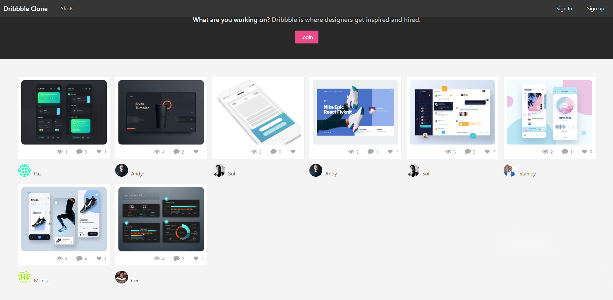
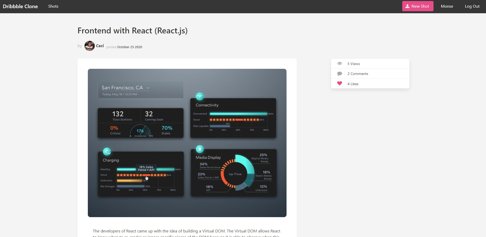
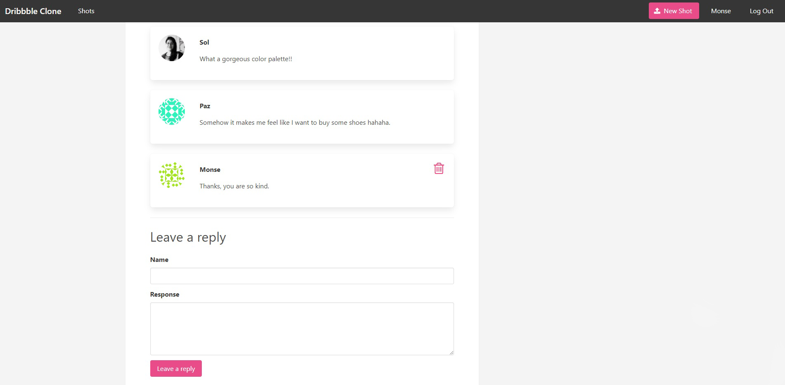

#  🧐 dribbble-clone

Dribbble is an active design community where designers of all varieties post their "shots" of whatever it is they are working on. What was originally intended to become more of "show your progress" type of site has become more of a portfolio for up and coming designers as well as seasoned pros.

## Our app will have the following features

- The ability to create, edit, and destroy "shots" as well as like and unlike individual shots.
- User roles and authentication
- Drag and drop functionality
- Commenting functionality
- View counts/analytics
- A custom responsive shot grid UI using CSS Grid







## 🔧 Built With these features
- Ruby. v2.6.6
- Ruby on Rails. v6.0.3.3
- Using Rubocop Linters.
- Bulma

## 🔴 Live Demo

[Live Demo Link](https://microverse-dribbble.herokuapp.com/)

## 🛠 Getting Started
## Install 
In order to run the project locally, you need to install Ruby in your computer. For windows you can go to [Ruby installer](https://rubyinstaller.org/) and for MAC and LINUX you can go to [Ruby official site](https://www.ruby-lang.org/en/downloads/) for intructions on how to intall it. Then you can clone the project by typing ```git clone https://github.com/Ceci007/dribbble-clone.git``` on your terminal.

## Run the application
To get a local copy up and running follow these simple example steps.

- Open a terminal
- Copy this code : ```git clone "put the link from github repo"```
- Run the program with this code: ```bundle install```
- Run the program with this code: ```rails db:create rails db:migrate```
- before running ```rails server``` you must run a few more commands: first run ```yarn install --check-files```, ```guard init livereload```, ```rails generate simple_form:install```, 
```rails generate devise:install``` then you can configure the Devise gem.
- now you can run ```rails server```
- Stop the program with: "Ctrl + C" (Windows or Linux) or "Command + C"(Apple)
- To have the full functionality check the Gemfile and configure all gems.

## Open app in browser

- When the program is running go to your browser
- put: localhost:3000/
- Click on login, register and create a new article
- Enjoy the app.

## ✒️ Authors
👤 **Andy Leverenz (web-crunch)**
- Github: [justalever](https://github.com/justalever)

👤 **Cecilia Benitez Casaccia**

- Github: [@Ceci007](https://github.com/Ceci007)
- LinkedIn:[LinkedIn](www.linkedin.com/in/cecilia-benítez)

## 🤝 Contributing
Contributions, issues and feature requests are welcome!

Feel free to check the [issues page](https://github.com/Ceci007/dribbble-clone/issues).

## 📝 License
This project is [MIT](lic.url) licensed.